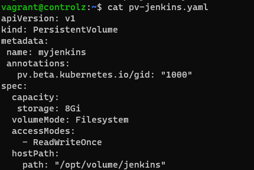
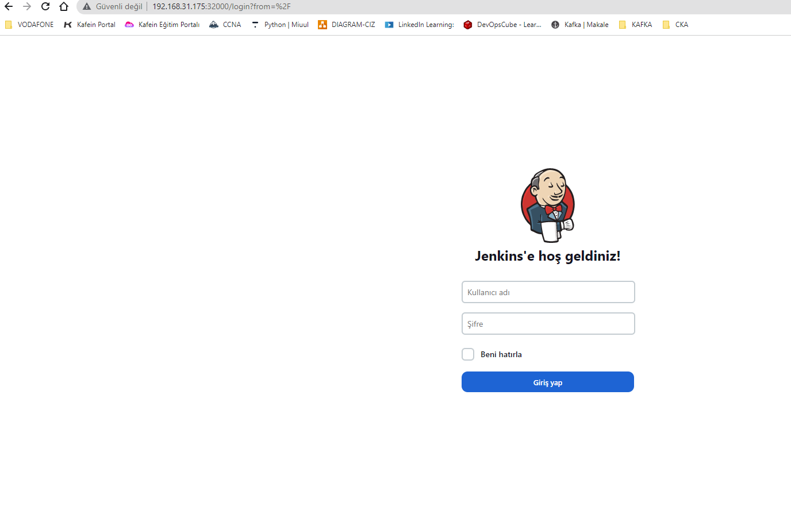

CI/CD SPRING BOOT PIPELINE PROJECT

In this project we will build spring boot hello world app, with Jenkins,
it deploy to k8s cluster which is based on oracle virtual platform.

When jenkins build triggered it will download source code from github
and build it with maven and create artifact which is a jar file, after
second phase kanik will build docker image according to Dockerfile, when
the build finishes third phase will begin taggin and pushing image to
DockerHub again with kaniko.

Last phase is kubernetes deploy, when build and push succesfuly
finished, Jenkins will change the image tag in deployment file which
located in github repo, then argocd will be triggered from that change
and will start to deployment.

Tech Stack

-   Vagrant

-   Oracle Virtual Box

-   Ansible

-   Docker

-   Kubernetes

-   Maven

-   Jenkins

-   Kaniko

-   ArgoCD

-   Git

-   Linux Ubuntu

-   Spring

-   Helm

**Phase 1 -- Setup Virtual Environment**

Virtual enviroment created with oracle virtual box via vagrant file.
According to vagrant file we will create below 4 virtual machines.

-   Control node: We will use it to control other machines via ansible
    and for k8s cluster via kubectl.

-   Master Node: Master role for k8s cluster

-   Worker Node: Worker1 role for k8s cluster

-   Worker Node: Worker2 role for k8s cluster

With Vagrant up command starting to build machines.

Vagrant status command checkig status of machines, all seems ready.

Connecting to control node with command vagrant ssh controlz

Connection to controlz node is succesfull, now we will start to
configure ssh keys for ansible to connect machines.

**Phase 2 -- Configure SSH keys**

Ssh-keygen command will create key.

Before ssh-copy-id command we are going to connect each node ( vagrant
ssh command ) and change **/etc/ssh/sshd_config** PasswordAuthentication
no to yes, because of ssh-copy-id command prevent public key error.

Then we are restarting sshd with sudo systemctl restart sshd.service

Now we are starting to copy generated key to all nodes with ssh-copy-id
command

Connect each node and press yes

**Phase 3 -- Configuring Ansible and Createing k8s cluster with
kubespray**

First we will clone kubespray repo and installing Python libraries.

git clone <https://github.com/kubernetes-sigs/kubespray.git>

cd kubespray ; sudo pip3 install -r requirements.txt

Creating ansible inventory file according to setup one master two worker
node.

Check with ping inventory file is working.

Now its time to build our k8s cluster.

ansible-playbook -i inventory/my-cluster/hosts.ini cluster.yml \--become
\--become-user=root

**Phase 4 -- Installing Kubectl and Helm to Controller Node**

We are installing kubectl according to instructions at
<https://kubernetes.io/docs/tasks/tools/>

When the installation is complete we check nodes with **kubectl get
pods** and we are getting error because of we dont have conf file of
cluster. Then we will connect master **ssh vagrant@node1** node and copy
/etc/kubernetes/admin.conf file to our contorller node path
\~/.kube/conf

Now we check again **kubectl get nodes**

Kubectl get pods -A

**Success!!**

We are installing helm according to instructions at
<https://helm.sh/docs/intro/install/>

We are checking helm installation with helm version

**Phase 4 -- Installing Jenkins with helm and installing kubernetes
plugin to Jenkins.**

helm repo add jenkins https://charts.jenkins.io

helm repo update

helm upgrade \--install myjenkins jenkins/Jenkins

Jenkins installation is complete now its time to get admin passowrd.

Kubectl exec --namespace default -it svc/myjenkins -c Jenkins \--
/bin/cat /run/secret/additional/chart-admin-password

When I check the Jenkins pod, relaised that it gives error because of
there is no persistenvolume, so I make hostpath volume for Jenkins with
below yaml.

Yaml for pv Jenkins

Kubectl get pods

Jenkins login

Now we will install Jenkins kubernetes plugin

configure Cloud Jenkins add as an agent.

We will use pod template to build and push our image

We have created a basic Freestyle Jenkins job to check everything is ok.

Freestyle Jenkins job finishes succesfully

**Phase 4 -- Writing pipeline and checking kaniko as a kubernetes pod**

Firs we will create docker secret at kubernetes to pull our images from
docker hub.

kubectl create secret docker-registry dockercred \\
\--docker-server=https://index.docker.io/v1/ \\
\--docker-username=**kocagoz** \\ \--docker-password=
dckr_pat\_\*\*\*\*\*\* \\ <--docker-email=kocagoz@gmail.com>

**create secret**

Kaniko-pod create

As a result kaniko succesfully send image to dockerhub

Now we will write our pipelines but first we have create credentianls
for github.

Not its time to write Jenkins pipeline

When we run pipeline job we get succses message and image pushed to
dockerhub.

**Phase 5 -- Installing argocd and writing deployment yaml files.**

First we will install argocd

kubectl create namespace argocd

kubectl apply -n argocd -f
<https://raw.githubusercontent.com/argoproj/argo-cd/stable/manifests/install.yaml>

Argocd installation is complete now we will gather admin password

kubectl -n argocd get secret argocd-initial-admin-secret -o
jsonpath=\"{.data.password}\" \| base64 -d; echo

We will enter argo and create new project

Project details.

sudo chown -R 1000:1000 /opt/volume/

