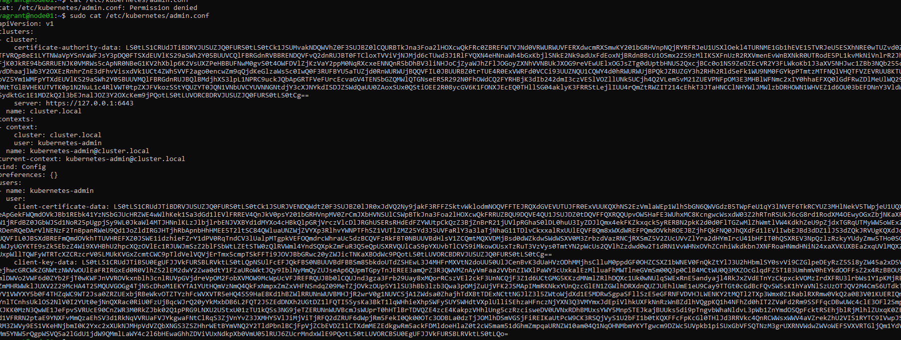
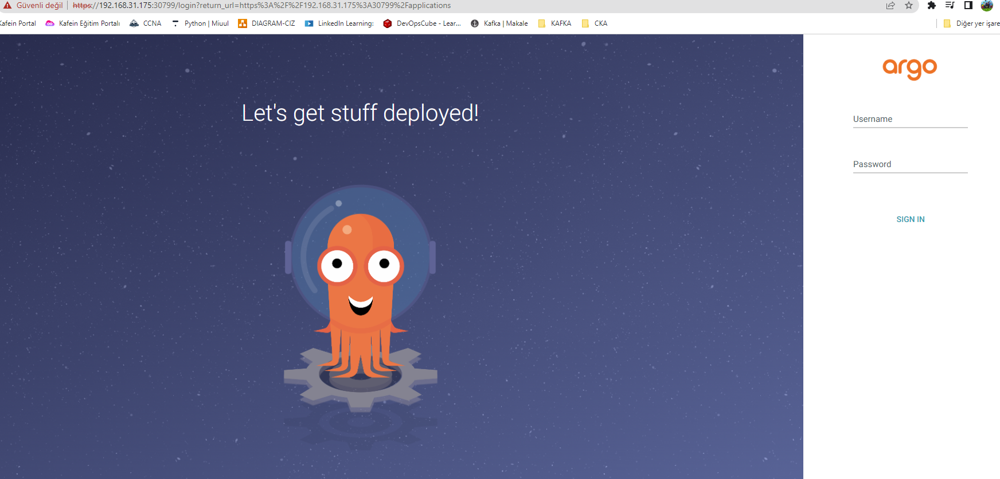
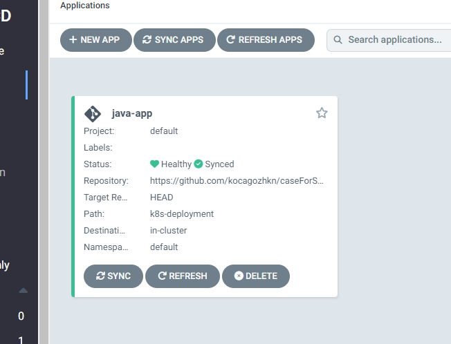
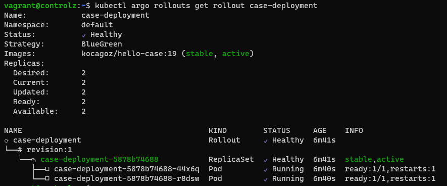
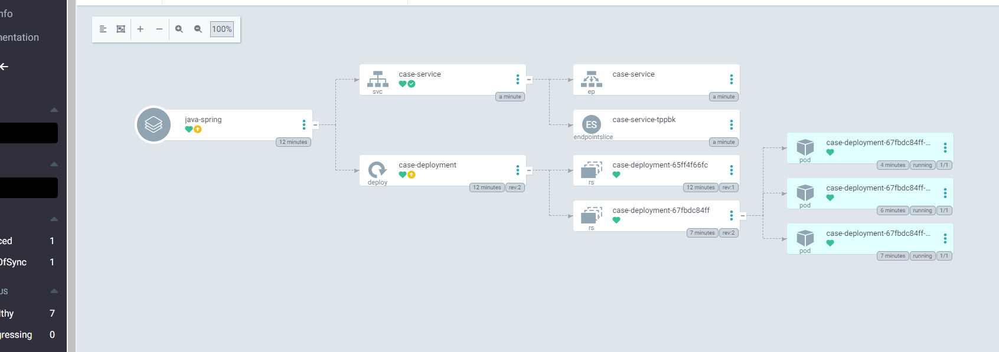
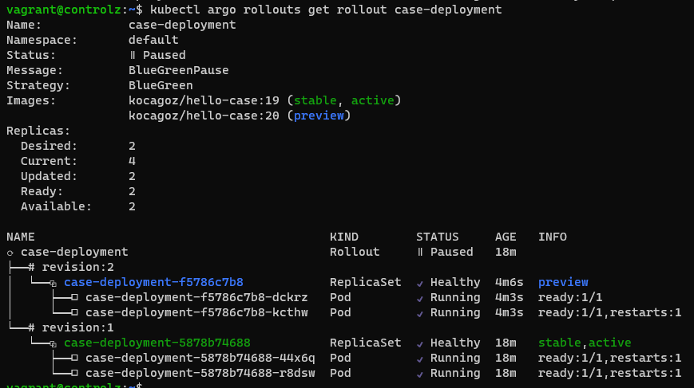
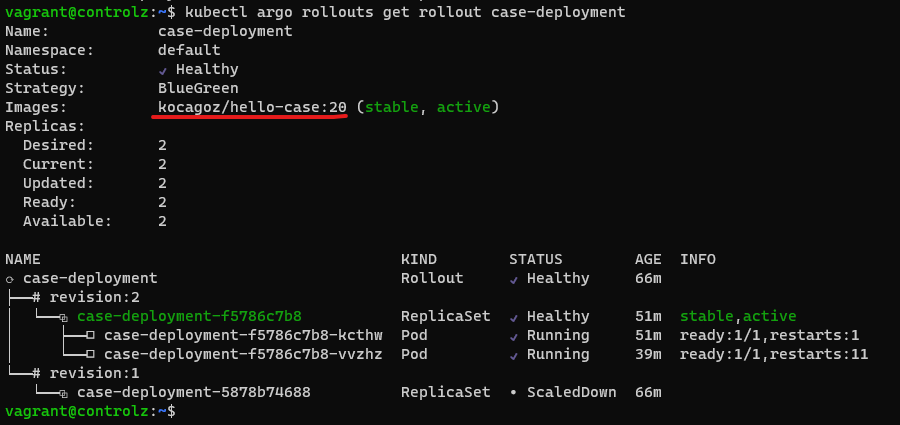

<p align="center">
<b>CI/CD SPRING BOOT PIPELINE PROJECT</b>
</p>
<p align="center">
<b>ENVIRONMENT</b>
</p>
<p align="center">
  

</p>

<p align="center">
<b>PIPELINE</b>
</p>
<p align="center">
  

</p>

In this project we will build spring boot hello world app, with Jenkins,
it deploy to k8s cluster with argoCD which is deployed on oracle virtual platform.

**stage-1**
When jenkins build triggered it will download source code from github
and build it with maven and create artifact which is a jar file, 

**stage-2**
Second stage kaniko will build docker image according to Dockerfile, and when
the build finishes kaniko will begin tagging and pushing image to
DockerHub.

**stage-3**
Last stage is kubernetes deploy, when build and push succesfuly
finished, Jenkins will change the image tag in deployment file which
located in github repo, then argocd will be triggered from that change
and will start to deployment new version of deployment. We can check blue-green deployment and promote to new version if everything is ok.

Tech Stack
<p align="center">
  
  
  
  
   
     

</p>


<p align="center">
 


          
      
          
      

     
</p>
<p align="center">
 
  


  
     
</p>

**Phase 1 -- Setup Virtual Environment**

Virtual enviroment created with oracle virtual box via vagrant file.
According to vagrant file we will create below 4 virtual machines.

-   Control node: We will use it to control other machines via ansible
    and for k8s cluster via kubectl.

-   Master Node: Master role for k8s cluster

-   Worker Node: Worker1 role for k8s cluster

-   Worker Node: Worker2 role for k8s cluster

With ```vagrant up``` command starting to build machines.


```vagrant status``` command checkig status of machines, all seems ready.


Connecting to control node with command ``vagrant ssh controlz``


Connection to controlz node is succesfull, now we will start to
configure ssh keys for ansible to connect machines.

**Phase 2 -- Configure SSH keys**

``ssh-keygen`` command will create key.


Before ``ssh-copy-id`` command we are going to connect each node ( vagrant
ssh command ) and change **/etc/ssh/sshd_config** ``PasswordAuthentication``
``no`` to ``yes``, because of prevent public key error due to``ssh-copy-id`` command.


Then we are restarting **sshd service** with ``sudo systemctl restart sshd.service``

Now we are starting to copy generated key to all nodes with ``ssh-copy-id``
command


Connect each node and press yes to add shh key.

**Phase 3 -- Configuring Ansible and Createing k8s cluster with
kubespray**

First we will clone kubespray repo and installing Python libraries.

``git clone <https://github.com/kubernetes-sigs/kubespray.git>``

``cd kubespray ; sudo pip3 install -r requirements.txt``


Creating ansible inventory file according to setup one master two worker
node.


To check inventory file is correct we will use simple ansible ping command.
``ansible -i inventory/my-cluster/hosts.ini -m ping all``


Now its time to build our k8s cluster.

``ansible-playbook -i inventory/my-cluster/hosts.ini cluster.yml --become
--become-user=root``


**Phase 4 -- Installing Kubectl and Helm to Controller Node**

We are installing kubectl according to instructions at

<https://kubernetes.io/docs/tasks/tools/>


When the installation is complete we check nodes with ``kubectl get
pods`` and we are getting error because of we dont have conf file of
cluster. Then we will connect master ``ssh vagrant@node1`` node and copy
**/etc/kubernetes/admin.conf** file to our contorller node path
**\~/.kube/conf**



Now we check again ``kubectl get nodes``


``kubectl get pods -A``


**Success!!**

Now its time to install **Helm**. We are installing **helm** according to instructions at
<https://helm.sh/docs/intro/install/>


We are checking helm installation with ``helm version``

**Phase 5 -- Installing Jenkins with helm and installing kubernetes
plugin to Jenkins.**

``helm repo add jenkins https://charts.jenkins.io``

``helm repo update``

``helm upgrade \--install myjenkins jenkins/Jenkins``


**Jenkins** installation is complete now its time to get **admin passowrd**.

``kubectl exec --namespace default -it svc/myjenkins -c Jenkins \--
/bin/cat /run/secret/additional/chart-admin-password``


When I check the **Jenkins** pod, relaised that it gives error because of
there is no persistentVolume, so I created hostpath volume for **Jenkins** with
below yaml.

Yaml for pv Jenkins


``kubectl get pods``


Jenkins login


Now we will install Jenkins **kubernetes** plugin


Configuring Cloud and adding kubernetes.


We will use **pod template** to build and push our image


We have created a basic **Freestyle Jenkins job** to check everything is ok.


Freestyle Jenkins job finishes succesfully


**Phase 6 -- Writing pipeline and checking kaniko as a kubernetes pod**

Firs we will create docker secret at kubernetes to pull our images from
docker hub.

``kubectl create secret docker-registry dockercred 
--docker-server=https://index.docker.io/v1/ 
--docker-username=**kocagoz**  --docker-password=
dckr_pat****** --docker-email=kocagoz@gmail.com>``

**create secret**


We will check is **Kaniko** working so, I created a simple Kaniko Pod, created pod with ``kubectl apply -f kaniko.yaml ``


As a result kaniko **succesfully** push image to dockerhub.


Now we will write our *pipeline*, but first we have to create *credentianls*
for github.


Not its time to write Jenkins **pipeline**


When we run pipeline job we get **succses* message and image pushed to
**dockerhub** and k8s manifest changed at **github**.


**Phase 7 -- Installing argocd and writing deployment yaml files.**

First we will install argocd

``kubectl create namespace argocd``

``kubectl apply -n argocd -f
<https://raw.githubusercontent.com/argoproj/argo-cd/stable/manifests/install.yaml>``


Argocd installation is complete now we will gather **admin** password

``kubectl -n argocd get secret argocd-initial-admin-secret -o
jsonpath=\"{.data.password}\" \| base64 -d; echo``


We need to create argo project for our deployment.

``kubectll apply -f application.yaml``


We will enter argo via browser.



Lets check our app.



Project details.


Now we can install argo cd roolout plugin accrding to link ``https://argoproj.github.io/argo-rollouts/installation/``

check argocd rollout cli is working.

`` kubectl argo rollouts version``

```kubectl-argo-rollouts: v1.3.2+f780534```


cli is working, check rollout status current app.

``kubectl argo rollouts get rollout case-deployment``







Now its time to check our spring app from browser, we used **nodeport 300055**, 


To make new **roolout** we will start our **jenkins job** and it will change **image tag** when the pipeline is succes, then argocd will be triggered and it will create *blue version* of app.



**blue version** of our app is deployed. Lets check is it working from **nodeport 30056**.


:thumbsup: blue version is working, now promote new version via. 

``kubectl argo rollouts promote case-deployment``

``rollout 'case-deployment' promoted``



We have prometed to **image version 20**

thanks your for reading. :thumbsup:


